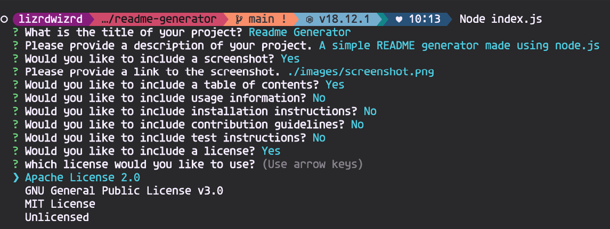

# Readme Generator

## Description

A simple README generator made using node.js

## Screenshot

## Table of Contents

- [Installation](#installation)

- [Usage](#usage)

- [License](#license)

- [Questions](#questions)

## Installation

n/a

## Usage

open your terminal and type node index.js

## License

This project is licensed under the MIT License.

## Questions

To reach me with additional questions, please send an email to lizzwizz@tuta.io.

GitHub: [Aloosli](https://github.com/Aloosli)

---

Return to [Table of Contents](#table-of-contents)
