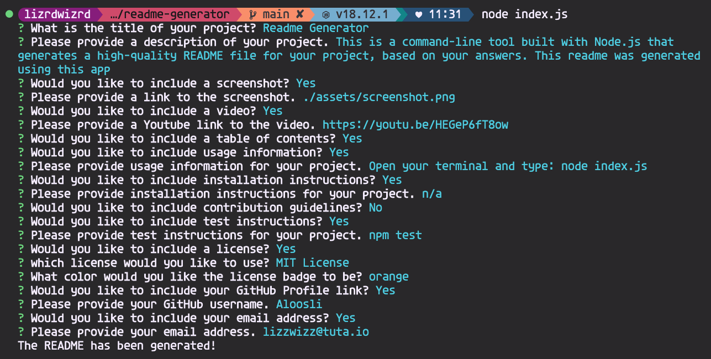

# Readme Generator

## Description

This is a command-line tool built with Node.js that generates a high-quality README file for your project, based on your answers. This readme was generated using this app

## Screenshot

## Video

Click the video thumbnail to open it in a new tab.

## Table of Contents

- [Installation](#installation)

- [Usage](#usage)

- [Test](#test)

- [License](#license)

- [Questions](#questions)

## Installation

n/a

## Usage

Open your terminal and type: node index.js

## Test

npm test

## License

This project is licensed under the MIT License.

## Questions

To reach me with additional questions, please send an email to lizzwizz@tuta.io.

GitHub: [Aloosli](https://github.com/Aloosli)

---

Return to [Table of Contents](#table-of-contents)
